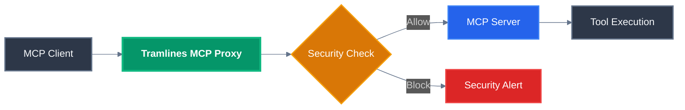

---
hide:
  - navigation
  - toc
---

# Welcome to Tramlines!

Tramlines is a **MCP gateway proxy server** that sits between AI agents and MCP servers, providing centralized control for observability and security. Think of it as a security checkpoint where every tool call request passes through Tramlines and gets evaluated against your security policies before reaching the actual MCP server.

## Why You Need Tramlines

MCP servers expose powerful tools to AI agents without built-in security controls, leaving your systems vulnerable to data exfiltration, system compromise, privilege escalation, and tool poisoning attacks. Tramlines provides essential protection through policy-based security with simple syntax, real-time attack blocking, session tracking for multi-step threats, complete audit trails, and drop-in integration that works with any existing MCP setup.

## How It Works



The process is straightforward: when an AI agent makes a tool call, Tramlines intercepts it and runs security policies to evaluate the request, making an allow or block decision. Safe requests proceed to the MCP server while dangerous ones are blocked and logged for security review.

## See the Difference

**Without Tramlines:**

```
AI Agent → "delete all log files" → MCP Server → Files deleted ❌
```

**With Tramlines:**

```
AI Agent → "delete all log files" → Tramlines → BLOCKED → Security Alert ✅
```

---
